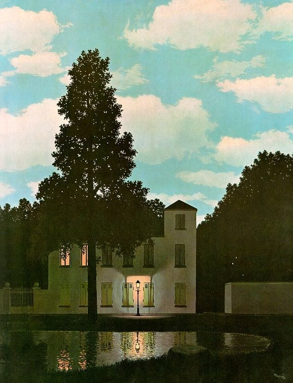
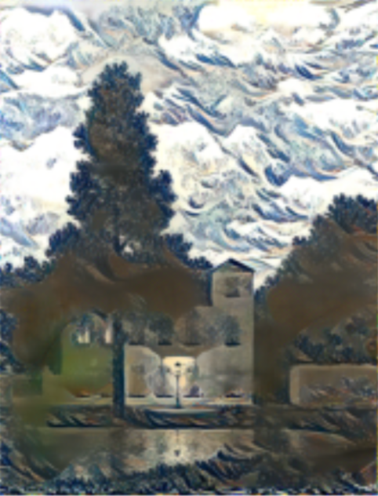

# Neural_Style_Transfer

[](https://github.com/pcsingh/Neural_Style_Transfer/)

This is a Deep Learning model which will help you to transfer an style onto your favourite image. I have used `VGG19` pre-trained model which consists of 16 convolution layers, 3 Fully connected layer, 5 MaxPool layers and 1 SoftMax layer. Below you can see the demo of the model.


 &emsp;&emsp;&emsp;&emsp; 

Output after 1000 iterations



## How can you use it?

You can use this model to transfer your favourite style on your content image. I am supposing that you know about the [Google Colab](https://colab.research.google.com/notebooks/intro.ipynb). First fork the repo from top right corner. Clone it using your cli tool. Go to the Google Colab or your local Jupyter Notebook and open `NST.ipynb` file.

Make small changes assign position of your style and content file to variables `style` and `content` in the second cell of notebook.
```python
style = 'your_style_image'
content = 'your_content_image'
```

Hurray! You are ready to see the output of the model. Run all the cells.

> **_Need help? feel free to contact @ [premchandra.singh.5268@gmail.com](mailto:premchandra.singh.5268@gmail.com?Subject=Neural_Style_Transfer)_**
